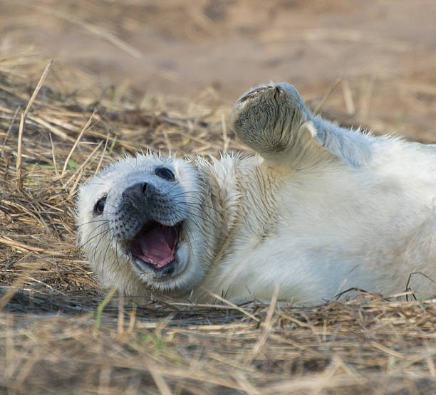

# Week 1 Assignment 
###### By Alejandra Villagran
--- 
### Introduction 
Hi! This is my first time on GitHub, and I am trying to figure this out!

## Schedule
----
This semester I am only taking two classes. These are both new concepts for me. 
|Classes|Dates|
| ----------- | ----------- |
|Data 110|Wednesday|
|CMSC 140|Tuesday|

### More about me 
### TV Shows I like 
- Severance
- American Horror Story
- Friends

#### Books I like

>1. *Oryx and Crake* Trilogy by Margaret Atwood 
>2. *All the Light We Cannot See* by Anthony Doerr
>3. *Cloud Cuckoo Land* by Anthony Doerr

I am open to new book recommendations! 

