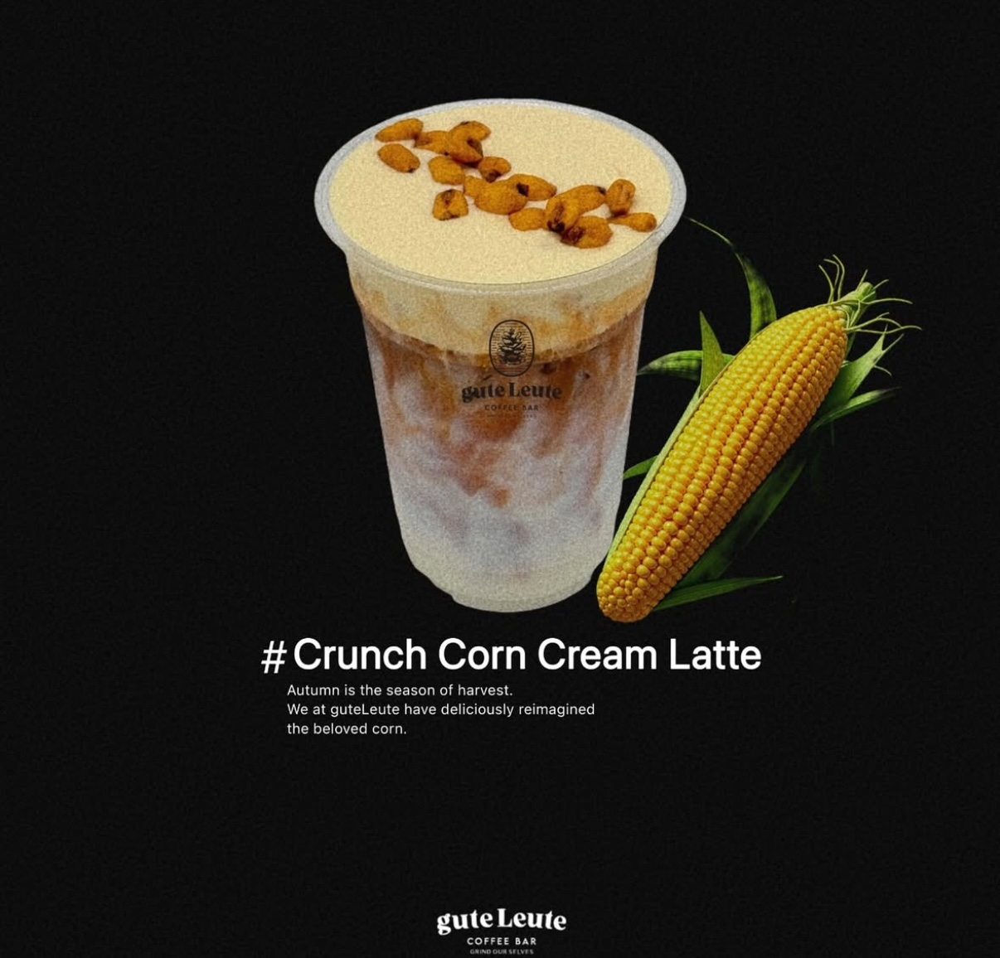
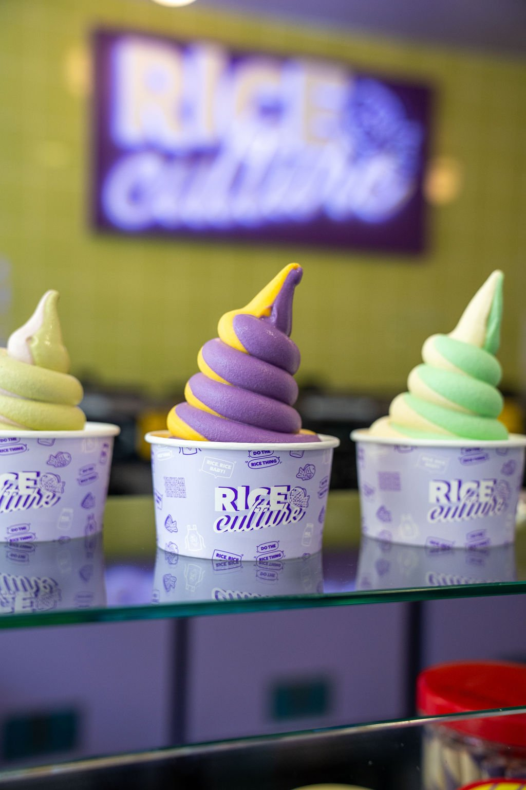

# Week 1 Assignment 
###### By Alejandra Villagran
--- 
### Introduction 
Hi! This is my first time on GitHub, and I am trying to figure this out!
[](https://www.nationalgeographic.com/animals/mammals/facts/seals-pinnipeds-walruses-sea-lions#:~:text=Seals%20range%20greatly%20in%20size,%2C%20100%2Dpound%20Baikal%20seal.&text=While%20there%20are%20many%20differences,fin%2Dfooted%22%20in%20Latin.)

## More about me 
----

### Schedule
This semester, I am taking two classes.
|Classes :pencil2:|Dates :calendar:|Times 🕥|
| ----------- | ----------- | ----------- |
|Data 110|Wednesday|6 - 8:40 PM|
|CMSC 140|Tuesday| 6 - 8:00 PM|

This is the *[Emoji Guide in Markdown](https://gist.github.com/rxaviers/7360908)*.

### Restaurants/Cafes I want to try in the DMV 
Below are some foods I want to try in the area. 
- [ ] Gute Leute Cafe 
- [ ] Rice Culture 
- [X] Gardenia's Cafe 


### TV Shows I like 
- Severance
- American Horror Story
- Friends

> #### Quote from Severance 
>
>  "The Work Is Mysterious And Important." [^1]
> [^1]:Santi, B. (2025, January 31). 10 best quotes in Severance, ranked. Game Rant. https://gamerant.com/best-quotes-severance-ranked/ 
>
>  *Mark* referencing his work at Lumon.

#### Books I like
I enjoy reading, but I haven't read anything in a while :( Below is a list of some of the books I enjoyed last year. If anyone has any good book recommendations, please share! 
>1. *Oryx and Crake* Trilogy by Margaret Atwood 
>2. *All the Light We Cannot See* by Anthony Doerr
>3. *Cloud Cuckoo Land* by Anthony Doerr


### Coding 
I have never coded, so my classes this semester are entirely new! If anyone has any recommended reading material or resources for a newbie in tech, I'd appreciate it! Right now, I mostly solve problems by watching YouTube videos. The first code I tried was in C ++ (P.S. Downloading Visual Studio and Clang on Mac was a nightmare; it took me two days, and I'm not sure it's installed correctly. Here is my first code in VS: 
```C++
#include <iostream>
int main() {
    std::cout << "Hello, World!" << std::endl;
    return 0;
}
```


